<h1 align="center">Hey 👋What's Up?</h1>

###

  
  
  
  
  
  
  
  
  
  
  

###

  
  

###

<picture>
  <source media="(prefers-color-scheme: dark)" srcset="./dist/pacman-contribution-graph-dark.svg">
  <source media="(prefers-color-scheme: light)" srcset="./dist/pacman-contribution-graph.svg">
  
</picture>

###
